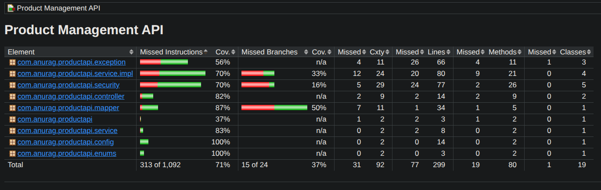

# Product Management API

A robust, production-ready RESTful API for managing products and inventory, built with **Java 17** and **Spring Boot 3**. This project demonstrates modern backend development practices including **JWT Authentication with Refresh Token Rotation**, **Role-Based Access Control (RBAC)**, **Dockerization**, and **Clean Architecture**.

---

## Key Features

*   **Secure Authentication**: Stateless JWT authentication with secure refresh token rotation.
*   **Role-Based Authorization**: Granular access control for `USER` and `ADMIN` roles.
*   **RESTful Design**: Resource-oriented URLs, standard HTTP methods, and consistent JSON responses.
*   **Pagination**: Efficient data retrieval for large datasets.
*   **Input Validation**: Comprehensive validation using Jakarta Validation constraints.
*   **Containerized**: Fully dockerized application and database using Docker Compose.
*   **Testing**: High test coverage with JUnit 5, Mockito, and H2 in-memory database.
*   **Documentation**: Auto-generated OpenAPI/Swagger documentation.

## Technology Stack

| Category | Technology |
| :--- | :--- |
| **Core** | Java 17, Spring Boot 3.x |
| **Database** | PostgreSQL (Prod), H2 (Test), Spring Data JPA |
| **Security** | Spring Security, JJWT (JSON Web Token) |
| **Testing** | JUnit 5, Mockito, Spring Boot Test |
| **DevOps** | Docker, Docker Compose, Maven |
| **Docs** | SpringDoc OpenAPI (Swagger UI) |

## Getting Started

### Prerequisites

*   **Java 17+** installed
*   **Maven** installed
*   **Docker** & **Docker Compose** (Recommended)

### Option 1: Run with Docker (Recommended)

The easiest way to run the application is using Docker Compose, which provisions both the API and the PostgreSQL database.

```bash
# 1. Clone the repository
git clone https://github.com/anurag-tarai/product-management-api.git
cd product-management-api

# 2. Build and start services
docker-compose up --build -d
```

The API will be available at `http://localhost:8080`.

### Option 2: Run Locally

If you prefer running without Docker, ensure you have a PostgreSQL instance running locally. The application will use the dev profile and local credentials.

1. **Set Environment Variables**
```bash
export DB_USERNAME=postgres
export DB_PASSWORD=password
export SPRING_PROFILES_ACTIVE=dev
```
2. **Build and Run Locally**
```bash
mvn clean install
mvn spring-boot:run
```
The API will be available at http://localhost:8080.

## API Documentation

Interactive API documentation is available via Swagger UI when the application is running.

*   **Swagger UI**: http://localhost:8080/swagger-ui/index.html
*   **OpenAPI Spec**: http://localhost:8080/v3/api-docs

### Core Endpoints

| Method | Endpoint | Description | Access |
| :--- | :--- | :--- | :--- |
| `POST` | `/api/v1/auth/signup` | Register a new user | Public |
| `POST` | `/api/v1/auth/login` | Authenticate and receive tokens | Public |
| `POST` | `/api/v1/auth/refresh-token` | Rotate access token | Public |
| `GET` | `/api/v1/products` | List products (Paginated) | Authenticated |
| `POST` | `/api/v1/products` | Create a product | User/Admin |
| `DELETE` | `/api/v1/products/{id}` | Delete a product | **Admin Only** |

## Testing
The project enforces code quality through Unit and Integration tests.  
Tests are run with JUnit 5, Mockito, and Spring Boot Test.
```bash
# Run all tests
mvn test
```
### Test Coverage:
> After running the tests, a JaCoCo HTML report is generated at:
`target/site/jacoco/index.html`


> Coverage shown is from the latest build.

## Security

*   **Authentication**: Implemented using JWT (JSON Web Tokens).
*   **Refresh Token**: Supports token rotation for enhanced security.
*   **Authorization**: Role-based access control (RBAC).
    *   `POST /api/v1/auth/signup`: Register a new user.
    *   `POST /api/v1/auth/login`: Login to get Access and Refresh tokens.
    *   `POST /api/v1/auth/refresh-token`: Get a new Access token using a Refresh token.
    *   `GET /api/v1/products`: Accessible by Authenticated Users.
    *   `POST /api/v1/products`: Accessible by `USER` or `ADMIN`.
    *   `PUT /api/v1/products/{id}`: Accessible by `USER` or `ADMIN`.
    *   `DELETE /api/v1/products/{id}`: Accessible by `ADMIN` only.

## Database Schema

**Product Table**
*   `id`: Primary Key
*   `product_name`: Indexed for faster search
*   `created_by`
*   `created_on`: Timestamp
*   `modified_by`
*   `modified_on`: Timestamp

**Item Table**
*   `id`: Primary Key
*   `product_id`: Foreign Key
*   `quantity`

## Docker Configuration

*   **Dockerfile**: Multi-stage build (or simple JDK image) to package the application.
*   **docker-compose.yml**: Orchestrates the Spring Boot API and PostgreSQL container.
